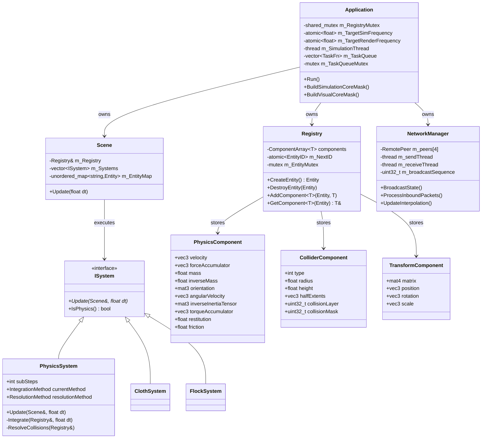
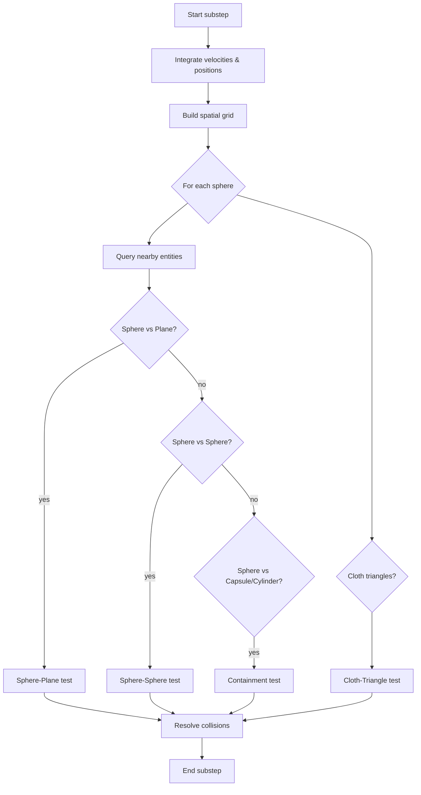
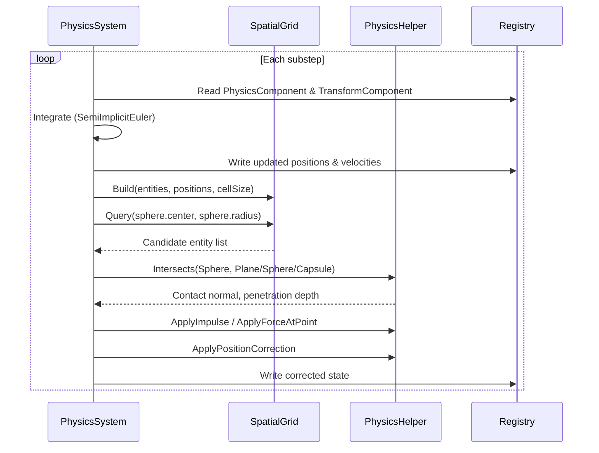

# 700105 Simulation and Concurrency Lab Book

## Final Lab

06/05/2026

### System Architecture

*System architecture, including where threads and networking have been used (1000 words max), plus UML diagrams*

The engine is built around an **Entity-Component-System (ECS)** architecture. A central `Registry` class owns all entities and their associated components, stored in typed `ComponentArray<T>` containers using a sparse-dense pattern for cache efficiency. The system supports up to 30,000 entities partitioned across four network peers (10,000 slots each), with atomic operations on entity ID allocation to prevent races at the boundary.

**Threading Model**

The `Application` class runs two persistent threads: a **render thread** targeting 60 Hz and a **simulation thread** targeting 120 Hz. These frequencies are stored as `std::atomic<float>` values so they can be tuned at runtime without synchronisation overhead on the hot path.

Access to the `Registry` is guarded by a `std::shared_mutex` (`m_RegistryMutex`). The render thread acquires a shared (read) lock when it snapshots component state for drawing, while the simulation thread takes an exclusive (write) lock when mutating physics or transform components. This reader-writer pattern allows multiple concurrent reads but serialises writes, keeping stall time low.

A task queue (`std::vector<std::function<void()>>` protected by `m_TaskQueueMutex`) lets one thread post deferred work onto the other — used, for example, when a collision callback on the sim thread needs to trigger a visual effect that must be set up on the render thread.

CPU affinity is applied at startup: `BuildSimulationCoreMask()` pins the sim thread to a dedicated physical core, and `BuildVisualCoreMask()` does the same for the render thread. This eliminates OS scheduler interference and reduces cache eviction between the two workloads.

Per-frame, the sim thread also takes **frame snapshots** (`FrameSnapshot` / `EntitySnapshot` structs) capturing transform, physics, animation, and collision state. These snapshots support lookahead and replay, enabling rollback-style reconciliation when networked state arrives out of order.

**Networking**

The engine uses a **TCP/UDP hybrid** via Winsock2. TCP handles reliable session management (peer join/disconnect events, authoritative ownership handshakes), while UDP carries high-frequency state broadcasts. Up to four `RemotePeer` structs hold a TCP socket and a UDP address each.

State is broadcast at ~30 Hz (`m_BroadcastInterval`). Each broadcast packet is stamped with a monotonic sequence number (`m_broadcastSequence`) so receivers can detect drops and reorder late arrivals. Each peer maintains a timestamp offset (`m_peers[i].timestampOffset`) calibrated on first contact, enabling frame-accurate interpolation of remote entity state.

Received UDP state is buffered in a deque-based `RemoteHistory` (depth 10) per peer. `UpdateInterpolation()` lerps between the two nearest history entries each frame, hiding jitter. The system also exposes configurable **latency simulation** (`m_simulatedLatencyMs`, `m_simulatedJitterMs`, `m_simulatedPacketLoss`) for testing under adversarial network conditions without a real wide-area link.

Dedicated send and receive threads (`m_sendThread`, `m_receiveThread`) decouple I/O from the sim loop. A `DelayedPacket` queue in the receive path applies simulated latency before packets are handed to the game logic.

**Systems**

All game logic is encapsulated in classes implementing `ISystem` (pure-virtual `Update(Scene&, float dt)`). The `Scene` holds an ordered vector of systems and calls each in sequence. Physics systems (`PhysicsSystem`, `ClothSystem`, `FlockSystem`) carry an `IsPhysics()` flag so the scheduler can run them multiple times per frame as substeps. Other systems include `AnimationSystem`, `ObjectSpawnerSystem`, `TimeSystem`, `WeatherSystem`, and `ThermodynamicsSystem`.

---

### Simulation

*How the motion physics has been implemented for the simulated objects, and how the collision detection and response has been implemented between the simulated objects and the other elements in the scene using diagrams where appropriate (1000 words max)*

Marks will be lost if the word limit is exceeded.

**Motion Physics**

Each simulated object carries a `PhysicsComponent` holding linear state (velocity, force accumulator, mass, inverse mass) and angular state (orientation as a 3×3 rotation matrix, angular velocity, inertia tensor and its inverse, torque accumulator). Forces are accumulated during a frame via `ApplyForce()` and `ApplyForceAtPoint()`, then cleared after each integration step.

`PhysicsSystem` supports three integration methods selected via `IntegrationMethod`:

- **Explicit Euler** — position updated with old velocity: prone to energy gain and instability at large timesteps.
- **Semi-Implicit (Symplectic) Euler** (default) — velocity updated first, then position uses the new velocity. This is energy-stable and momentum-conserving, making it well-suited to persistent rigid-body and cloth simulation.
- **RK4** — four intermediate evaluations blended with weights (1/6, 1/3, 1/3, 1/6). Offers higher accuracy at roughly four times the cost; used when precision outweighs performance.

To improve stability without switching integrators, the sim thread runs **substep integration** (`subSteps = 4` by default). Each engine frame is subdivided into `N` smaller timesteps (`dt_sub = dt / N`); both integration and collision resolution execute once per substep. This prevents fast-moving objects tunnelling through thin geometry and keeps spring and cloth constraints from blowing up.

Gravity is applied as `force = mass × gravityDirection × 9.8 m/s²`. Optional linear damping multiplies velocity by a factor each substep (`v *= dampingFactor`, exponential decay), and quadratic drag models air resistance as `F = -k|v|²v̂`. Angular integration updates the orientation matrix from the angular velocity vector each substep; torque is converted to angular acceleration via `α = I⁻¹τ`.

Sleep thresholds (`sleepNormalThreshold` and `sleepTangentialThreshold`, default 0.08 m/s and 0.12 m/s) zero out velocity components below the threshold after collision resolution, preventing infinite low-energy micro-bouncing.

**Collision Detection**

The engine models five collider shapes defined in `SimulationStaticLib`: **Sphere**, **AABB**, **Plane**, **Capsule**, and **Cylinder**. Each has an `Intersects()` method for pairwise geometric tests.

Broadphase uses a **uniform spatial grid** (`SpatialGrid::UniformGrid3D`). `Build()` partitions the world into fixed-size cells and slots entities by position; `Query(pos, radius)` then returns only entities within neighbouring cells in O(1) average time, avoiding the O(n²) all-pairs check.

Narrowphase tests the candidate pairs returned by the grid. The pipeline per substep is:

**Collision Response**

Two resolution strategies are selectable at runtime via `ResolutionMethod`:

**Impulse-based** (default): An instantaneous velocity change is applied to both objects. For a sphere–sphere contact the impulse magnitude is:

`j = -(1 + e) × v_rel·n̂ / (m₁⁻¹ + m₂⁻¹)`

where `e` is the combined restitution coefficient, `v_rel` is relative velocity at contact, and `n̂` is the contact normal. The angular contribution from the contact offset (`r × impulse` transformed by the inverse inertia tensor) updates `angularVelocity` simultaneously. For sphere–plane the denominator is just `m⁻¹` since the plane is static.

**Force-based**: Instead of an impulse, a corrective force is added to the accumulator and integrated on the next substep. Chosen when smoother, continuous response is preferable to a sharp velocity flip.

**Friction** is applied as a tangential impulse clamped by the Coulomb cone: `|j_t| ≤ |j_n| × μ`, where `μ` comes from `ComputeContactFriction(f1, f2, globalScale)` combining per-object friction values. This prevents surfaces from accelerating objects and realistically bleeds tangential velocity on impact.

**Position correction** (`ApplyPositionCorrection`) separates overlapping objects by displacing each proportionally to its inverse mass (heavier objects move less), resolving penetration before the next integrate step.

**Cloth-triangle** collision distributes impulse across the three cloth particle vertices using barycentric weights `(u, v, w)` so that triangles deform naturally rather than receiving a rigid-body impulse.

**Springs and Cloth**

`SpringComponent` implements Hooke's law with damping: `F = -k(L - L_r) - b·v_spring`, where `k` is stiffness, `L_r` rest length, and `b` a damping coefficient. Springs connect pairs (or hubs of) entities and feed forces into the standard accumulator each substep. The `ClothSystem` lays a grid of particle entities connected by structural springs and resolves cloth-specific sphere and plane penetration each frame, updating a dynamic geometry buffer for rendering.
